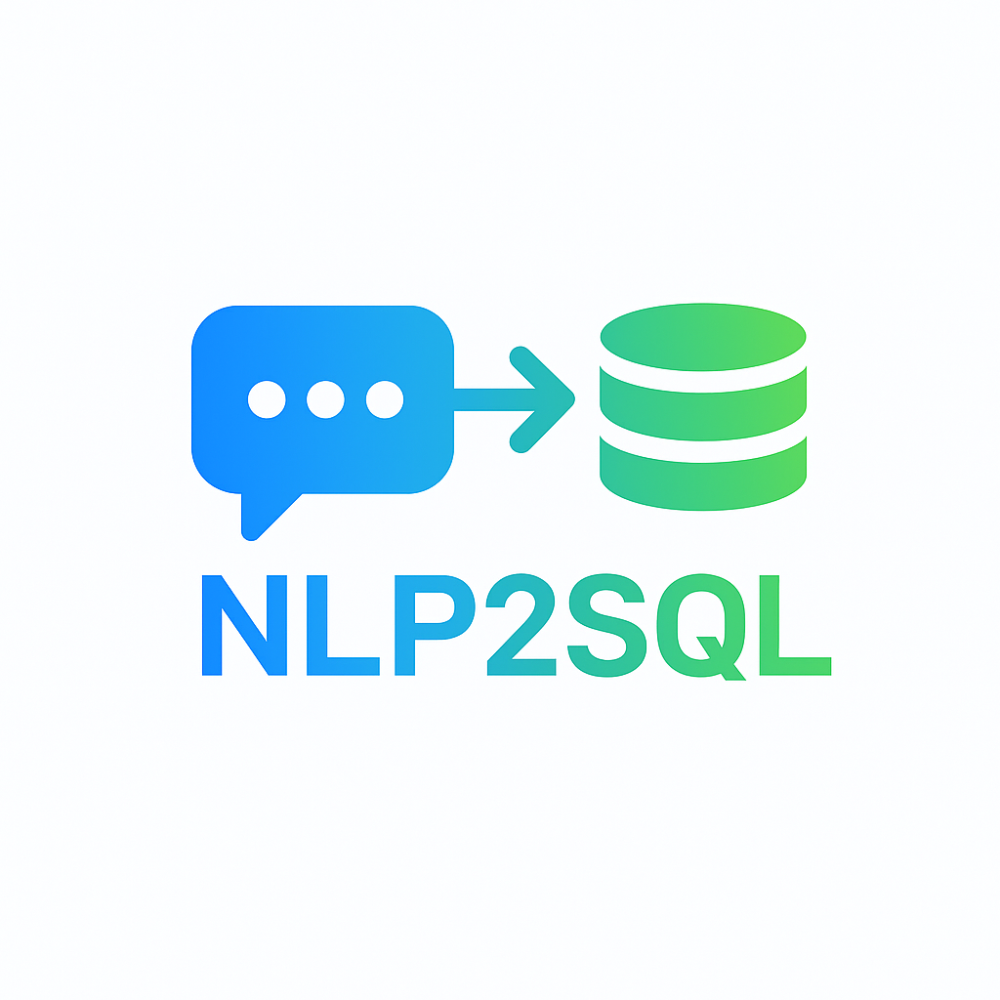

# Natural Language to SQL 

## Overview
Proof of Concept converting English questions to SQL queries using OpenAI.

## Features
- In-memory SQLite database
- Automatic SQL generation
- Error correction with 3 retries

###setup
    
   1. Set up a virtual environment
      python3 -m venv n2s
      cd n2s
      source n2s/bin/activate
    
   2. Install the requirments 
      pip3 install -r requirements.txt

   3. Add OpenAI API key to .env file
      OPENAI_API_KEY=your_key_here
   
   4. Run the code
      python3 nlp2sql.py
      add the questions in the nl2sql.py inside the the  questions =[] 
      in the main function seperated by commas.
      
## Example Output

      
      
          
